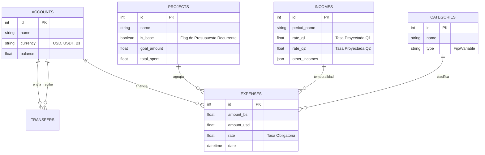
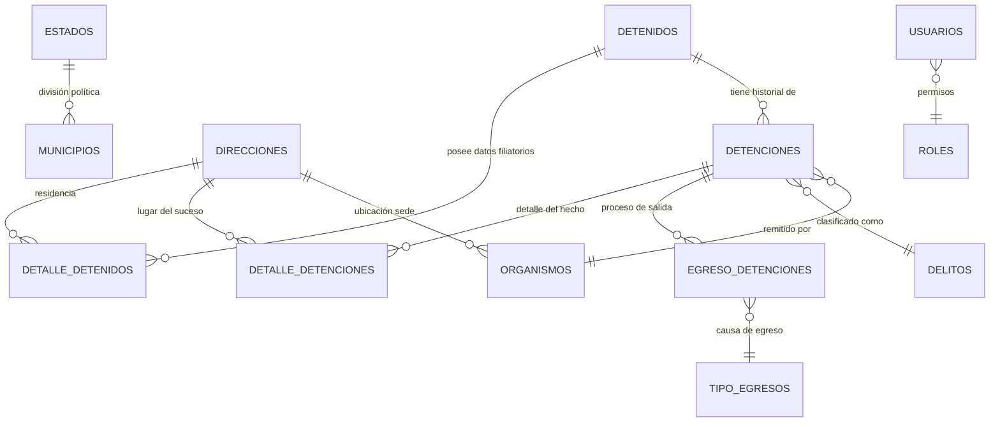
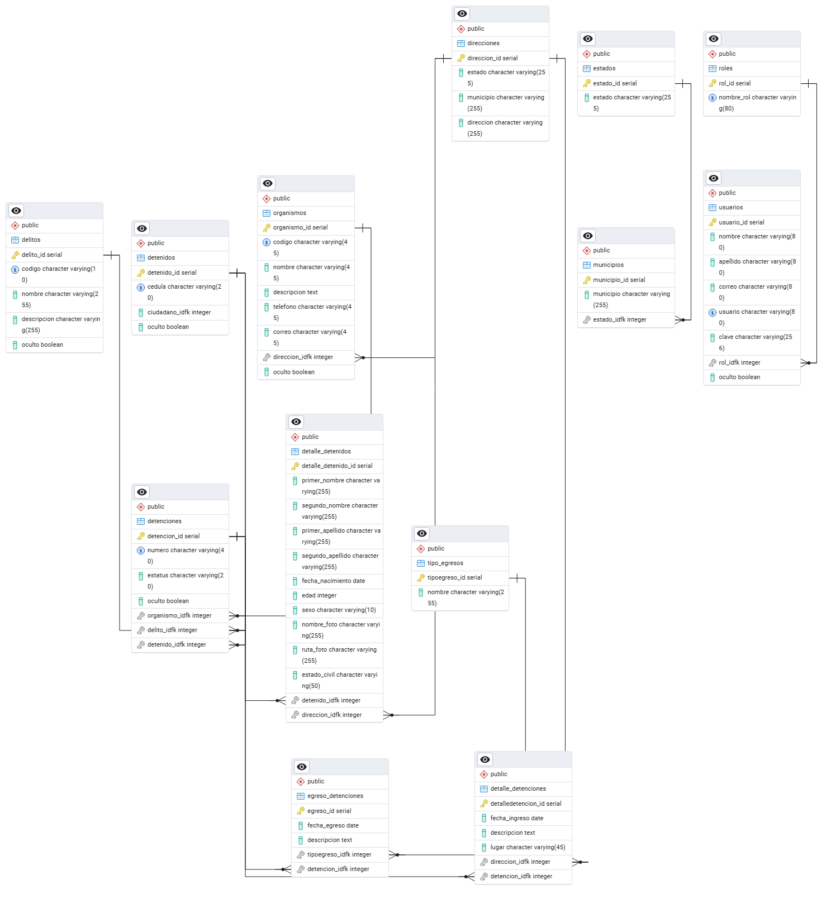

# 0. Especificaciones Técnicas

# A. Finael App - Capital Planning Engine

## 1. Visión General
Este esquema soporta un **Motor de Planificación de Capital Multimoneda**. A diferencia de los gestores de gastos tradicionales, este diseño se centra en la gestión del **Capital Base** (balances reales en bancos/cripto) y su asignación a **Proyectos (Metas)** o Presupuestos Operativos.
El sistema está diseñado para operar en entornos de alta volatilidad económica, permitiendo transacciones en múltiples monedas (Bs, USD, USDT) normalizadas a través de tasas de cambio explícitas.

## 2. Diagrama Entidad-Relación (ER)

## 3. Diccionario de Datos y Reglas de Negocio
### 3.1. Accounts (Capital Base)
Representa la "Verdad Financiera". El balance físico real del usuario.
- **Restricción de Negocio**: `currency` está limitado estrictamente a `USD`, `USDT`, `Bs` para mantener la integridad de los cálculos de conversión.
- **Tipos**: Soporta `cash` (Efectivo), `bank` (Bancos Nacionales) y `crypto` (Wallets).

### 3.2. Projects (Lógica de Asignación)
Permite separar el dinero en "cubetas mentales" sin moverlo de las cuentas reales.
- **Atributo `is_base`**: Diferencia el "Presupuesto de Supervivencia" (Comida, Servicios) de los "Proyectos de Ahorro" (Carro, Viaje).
- **Atributo `total_spent`**: Acumulador desnormalizado para consultas rápidas de progreso vs. `goal_amount`.

### 3.3. Incomes (Motor de Proyecciones)
Tabla central para la planificación.
- **Estructura Quincenal**: Diseñado específicamente para nóminas divididas (`amount_q1` y `amount_q2`).
- **Proyecciones**: Almacena `rate_q1` y `rate_q2`, que son calculados algorítmicamente (Tasa Real * Factor de Crecimiento) antes de insertar el registro.
- **Campo JSON**: `other_incomes_json` permite flexibilidad NoSQL para ingresos irregulares (Freelance) dentro de una estructura SQL rígida.

### 3.4. Expenses (Transacciones Unificadas)
La tabla transaccional principal.
- **Integridad Cambiaria**: La columna `rate` es **obligatoria**.
    - *Razón*: En economías inflacionarias, saber que gastaste 100 Bs no es suficiente; necesitas saber a qué tasa ocurrió para calcular el impacto real en dólares.
- **Relaciones Polimórficas (Simuladas)**: Un gasto puede pertenecer a un Proyecto (`project_id`) y a una Categoría (`category_id`), permitiendo doble dimensión de análisis.

### 3.5. Transfers
Maneja la conversión de divisas.
- Es la única forma de mover valor entre monedas (ej. Vender USDT -> Recibir Bs).
- Registra el `rate` de la operación para calcular PnL (Profit and Loss) por diferencial cambiario.

## 4. Decisiones de Diseño
1.  **SQLite como Motor**: Se eligió por su portabilidad para aplicaciones locales (`serverless`), usando modo WAL (Write-Ahead Logging) para concurrencia básica.
2.  **Manejo de Monedas**: Se evita el tipo `DECIMAL` (ausente en SQLite nativo) usando `REAL`, con redondeo controlado en la capa de aplicación (Backend Python) a 2 decimales.
3.  **Normalización de Tasas**: Las tasas históricas se separan en `exchange_rates` para análisis de tendencias, pero se *snapshottea* (copia estática) la tasa en la tabla `expenses` en el momento de la transacción para preservar la historia inmutable del gasto.

---

# B. SIPMG - Sistema de Información de la Policía Municipal de Guaicaipuro

SIPMG es una solución integral para la gestión y seguimiento de información de detenidos. El proyecto ha evolucionado de una arquitectura monolítica a una estructura de API modernizada.

## 1. Evolución del Proyecto

### Versión 1: Sistema Legado (PHP)
- **Stack**: PHP, MySQL / MariaDB, Materialize CSS, jQuery.
- **Enfoque**: Aplicación web monolítica centrada en formularios directos y gestión básica de CRUD.
- **Características**: Autenticación simple, generación de reportes PDF con Dompdf, y manejo de historiales en tablas relacionales básicas.

### Versión 2: SIPMG API Modernizada (Python Flask)
- **Stack**: Python (Flask), PostgreSQL, SQLAlchemy.
- **Enfoque**: API RESTful diseñada para escalabilidad, con una base de datos altamente normalizada y soporte para auditoría.
- **Mejoras Clave**:
    - **Normalización Avanzada**: Separación de entidades geográficas (`estados`, `municipios`) y direcciones reutilizables.
    - **Integridad de Datos**: Uso de restricciones `UNIQUE` y llaves foráneas estrictas en PostgreSQL.
    - **Gestión de Auditoría**: Implementación de campos `oculto` (soft delete) para preservar la integridad histórica.
    - **Seguridad**: Sistema de roles dinámico y contraseñas hasheadas.

## 2. Lógica de la Base de Datos (v2)

El esquema de la versión 2 está diseñado para capturar la complejidad de los procedimientos policiales, permitiendo múltiples detenciones por ciudadano y un seguimiento detallado de cada evento.

### Diagrama de Entidad-Relación (V2)

### 3. Visualización del Esquema (V2)
A continuación se adjunta la arquitectura visual generada desde la herramienta de modelado:

## 4. Instalación (Versión General)
1.  **V1 (PHP)**: Clonar en `htdocs`, configurar `conexion_db.php` e importar `database_schema.sql`.
2.  **V2 (Flask)**: Configurar entorno virtual, instalar `requirements.txt`, configurar `DATABASE_URL` e importar `sipmg_api_v2_schema.sql` en PostgreSQL.

---

*Estos esquemas forman parte del portafolio de SQL de Daniel José Pacheco Rodríguez.*
